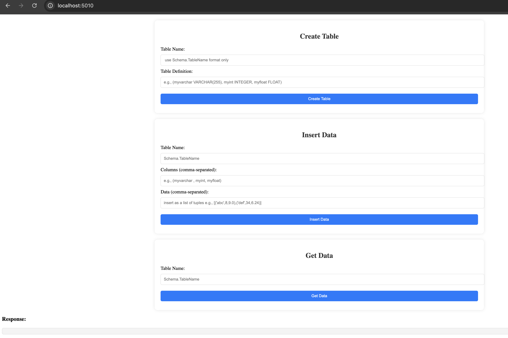

## simpleFlask

1. Change directory to the project folder:

    ```bash
    cd simpleFlask
    ```

2. Start the application using Docker Compose:

    ```bash
    docker compose up
    ```

3. Open your browser and go to:

    [http://localhost:5010](http://localhost:5010)


